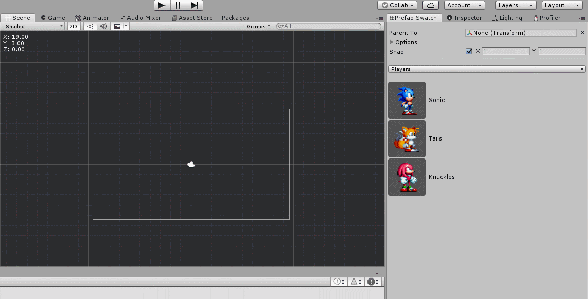

# **PrefabSwatch**
A Unity tool that allows for fast placement of prefabs in a 2D Scene

# How to Use

a. First Create a Prefab Swatch

* Assets > Create > Prefab Swatch

b. Select the created Prefab Swatch file and add Prefabs to it

c. Open the Prefab Swatch Window

* Window > Prefab Swatch...

d. Use the Swatches

Click on the list to select a prefab then click on the Scene to add it.
Undo is supported if you make a mistake.
When done, press the ESC key to return to the Unity Scene controls.
